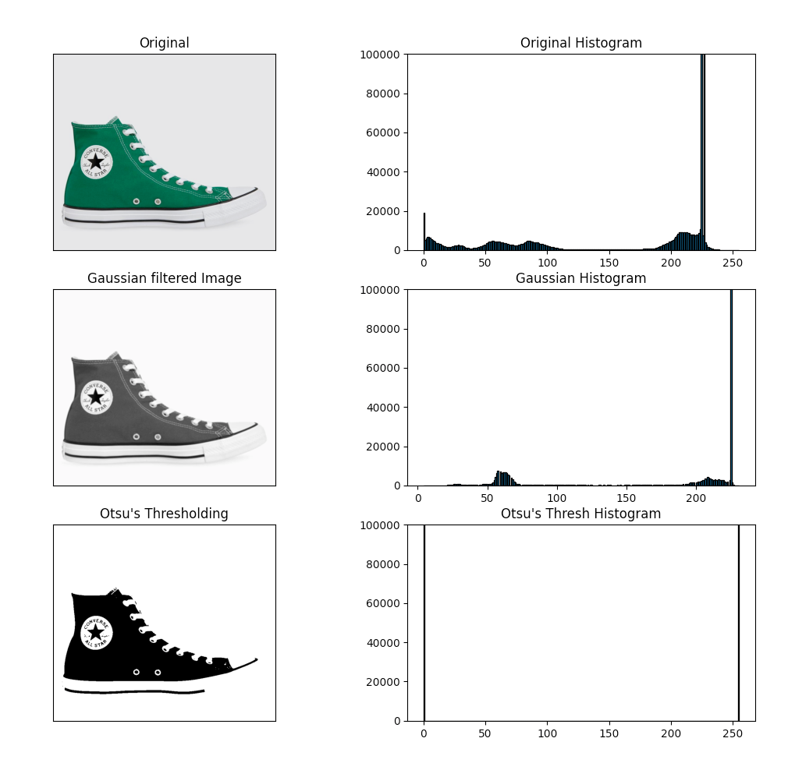
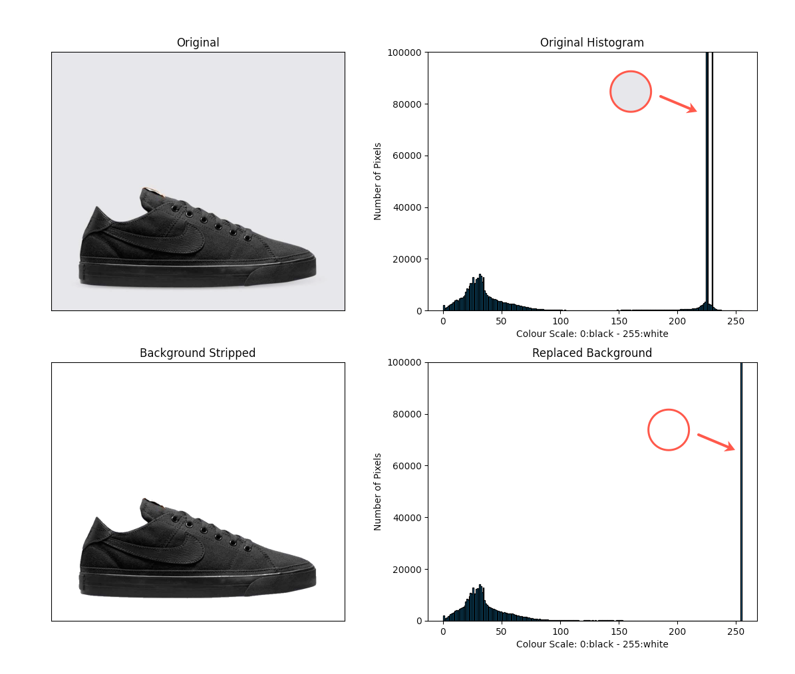

# image-object-and-colour-detection

A Python project to explore image processing: object and colour detection

## Step 1 - Import your image and resize

Resizing TBC??

Using the cv.imread(), import the images in the original and greyscale formats:

```
original_img = cv.imread('./src/media/image1.jpg', cv.IMREAD_UNCHANGED)
greyscale_img = cv.imread('./src/media/image1.jpg', cv.IMREAD_GRAYSCALE)
```

Note, OpenCV uses BGR as its default colour order for images, matplotlib uses RGB. When you display an image loaded with OpenCv in matplotlib the channels will be back to front:

```
original_RGB = cv.cvtColor(original, cv.COLOR_BGR2RGB)
```

## Step 2 - Isolate the subject and filter background

To isolate the subject and filter out the background CV Image Threasholding should be leveraged.

Image Threasholding applies fixed-level thresholding to a multiple-channel array. The function is typically used to get a bi-level (binary) image out of a grayscale image ( compare could be also used for this purpose) or for removing a noise, that is, filtering out pixels with too small or too large values. There are several types of thresholding supported by the function, however, the current project will focus on 'Otsu's thresholding'.

For more info relating to all other types, see the OpenCV docs page:
https://docs.opencv.org/4.5.2/d7/d4d/tutorial_py_thresholding.html

### 2A) Build the Bimodal Distribution Map

Let's start with what is a bimodal image? This, also can be aligned to a bimodal distribution (two peaks). Data distributions in statistics can have one peak, or they can have several peaks. The type of distribution you might be familiar with seeing is the normal distribution, or bell curve, which has one peak. The bimodal distribution has two peaks.

Therefore, using a test image of your chosing, the first goal should be to identify the bimodal model and then separate the primary peak from the secondary peak. Consider an image with only two distinct image values (bimodal image), where the histogram would only consist of two peaks. A good threshold would be in the middle of those two values. Similarly, Otsu's method determines an optimal global threshold value from the image histogram.



### 2B) Filter backgound

Using the identified bimodal distribution, and create the new image.
Where black (0) keep the original image pixel, where white (0) replace with white.

```
new_original = []
for i in range(th3.shape[0]):
    new_original.append([])
    for j in range(th3.shape[1]):
        if(th3[i][j] == 0):
            new_original[i].append(original_RGB[i][j])
        else:
            # set background white
            new_original[i].append(np.array([255, 255, 255]))
```

In the example below the grey background, becomes white in the bimodal distribution map which can be easily identified in the


## Step 3 - Determine the average of the filtered out background

TBC - in progress
